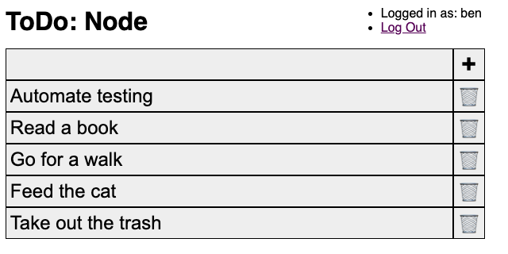

# todo-node

This is a to-do app built with [Node.js](https://nodejs.org/). It's an exercise
to learn web development fundamentals, using only HTML, CSS, JavaScript, &
the Node.js runtime.

## Exercise Constraints
- No libraries, frameworks, templates, or preprocessors other than what Node.js
  provides itself
- No dev tools except Git, an editor, a web browser, and
  [nodemon](https://www.npmjs.com/package/nodemon)




## Setup
To run this yourself, you will need to install Node.js on your operating
system. Then, install `nodemon` globally, with:
```sh
npm install -g nodemon
```
Finally, run the Node server with:
```sh
cd src
nodemon .
```
`nodemon` is an alternative the `node` command that automatically restarts the
server when you make changes to the source code, so you don't have to restart
the server manually.

favicon by [Twemoji](https://twemoji.twitter.com/), licensed as [CC-BY
4.0](https://creativecommons.org/licenses/by/4.0/).
