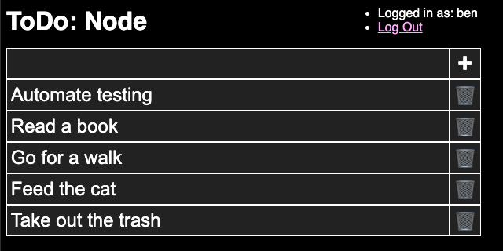

# todo-node

This is a to-do app built with [Node.js](https://nodejs.org/). It's an exercise
to learn web development fundamentals, using only HTML, CSS, JavaScript, &
the Node.js runtime.

## Exercise Constraints
- No libraries, frameworks, templates, or preprocessors outside Node.js
- Limited dev tools:
  - [ESLint](https://www.npmjs.com/package/eslint)
  - [nodemon](https://www.npmjs.com/package/nodemon)

## Goals
- [x] [As simple as possible, but not simpler](https://quoteinvestigator.com/2011/05/13/einstein-simple/)
- [x] Create, read, update, and delete tasks
- [x] Store tasks on the server
- [x] Provide secure authentication




## Development
Install the dependencies by running:
```sh
npm install
```
Start the node server with:
```sh
npm run dev
```
Run the automated test suite with:
```sh
npm run test
```
Identify syntax and style issues with:
```sh
npm run lint
```

favicon by [Twemoji](https://twemoji.twitter.com/), licensed as [CC-BY
4.0](https://creativecommons.org/licenses/by/4.0/).
